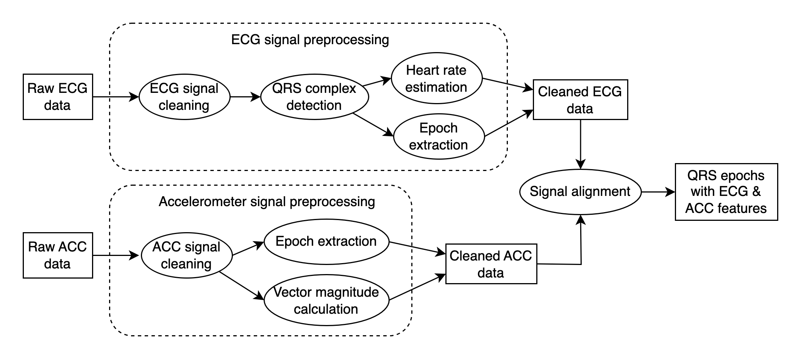

## Biomedical Signal Processing 
A pipeline for preprocessing biomedical signals (currently supporting electrocardiogram (ECG) and accelerometry signal).


## Installation
```
# Clone the repository
git clone https://github.com/qjin7796/BMSP.git

# Create a virtual environment named dndp_env (prerequisite: Python 3.11)
python3.11 -m venv /path/to/dndp_env
# Activate the environment
source /path/to/dndp_env/bin/activate
# Check the location and version of the python interpreter
which python
python -V

# Install requirements
python -m pip install -U -r /path/to/requirements.txt
```

## Demo
#### Screen D1NAMO dataset structure
Configure and execute
```
python /path/to/BMSP/bmsp_screen_d1namo.py
```
#### Preprocess ECG/accelerometer data
Configure and execute
```
python /path/to/BMSP/bmsp_preprocess_d1namo.py
```
Preprocessed ECG output: cleaned signal, stats, quality assessment, extracted epochs.    

Preprocessed accelerometer output: cleaned signal, stats, extracted epochs.    

ECG epochs are aligned with cleaned accelerometer signal and stats.
